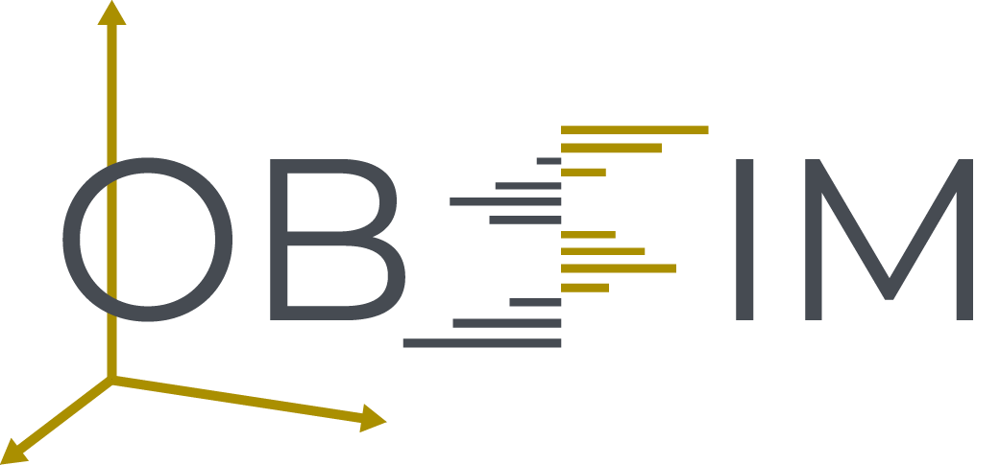

<p align="center">
  
</p>

# LOBSIM — Limit Order Book Simulator

[](https://github.com/kpetridis24/lobsim/actions/workflows/ci.yml)
[](LICENSE)

`lobsim` is a fast, deterministic **L3 limit order book replay + paper execution simulator** for market microstructure research and strategy prototyping.

It consumes an event stream (historical and/or strategy-injected), maintains a **per-order (L3)** book state, and emits facts (fills + diagnostics) via a pluggable sink interface.
The core is written in **C++20** for performance, with **Python bindings** for research workflows.

## Why use it
- **Research faster**: replay event-by-event, inspect the book, inject your own strategy orders, and analyze fills in one loop.
- **Model-in-the-loop**: compute signals or run ML inference on live book views during replay (without breaking event ordering).
- **Stay reproducible**: deterministic engine + structured outputs make results debuggable and comparable across runs.
- **Works in Python and C++**: run research in notebooks and deploy the same mechanics in native code.
- **Measure execution**: fills include maker/taker metadata and timestamps, so you can evaluate queueing and fill quality.
- **Lightning fast**: the core is C++20; Python bindings keep research workflows responsive even on large event streams.
- **Built-in observability**: structured fills, event-application records, and diagnostics make it easy to debug, audit, and understand your event stream.
- **Roadmap**: multi-book replay + monitoring primitives for cross-venue analysis (e.g., arbitrage/hedging research) is a planned extension.

## Core concepts
- **`PaperTradingSimulator`**: the main engine. Call `update(NormalizedLobEvent)` and query the book (`getBestPriceTicks`, `depthAt`, `l2TopN`).
- **`NormalizedLobEvent`**: the canonical event schema (`ADD`, `DELETE`, `SUBTRACT`, `MATCH`, `SET`) plus metadata (`UpdateSource::{HISTORICAL,STRATEGY}`).
- **`ReplaySession`**: helper to step events and optionally enforce monotonic `tsReceived` during replay.
- **`ILogSink` / `InMemoryLogSink`**: structured observability for research and debugging.
- **`FillRecord` / `EventApplyRecord` / `DiagnosticRecord`**: the emitted facts: fills, applied events, and warnings/errors with event context.

## Installation / prerequisites (developer build)
This repo is built with CMake and ships Python bindings via `pybind11`.

**Dependencies**
- C++: CMake, Ninja, a C++20 compiler
- Arrow/Parquet (for the provided parquet sources/examples)
- Python: 3.11+ (bindings), `pybind11` (CMake package)

**Sample data is stored in Git LFS**
```bash
git lfs install
git lfs pull
```

## Quickstart
### C++ build + tests
```bash
./scripts/make_cpp.sh
```

### Build Python bindings + install editable package
```bash
./scripts/make_all.sh
python -m pip install -e python
python -c "import lobsim; from lobsim.engine import PaperTradingSimulator; print('import ok')"
```

## Examples
### Streamlit demos (recommended)
After building the Python bindings (see Quickstart), install demo deps and run:
```bash
python -m pip install streamlit plotly pyarrow

lobsim demo replay   # replay explorer
lobsim demo trend    # trend-following baseline
```

If your shell can’t find the `lobsim` command, run the same via:
```bash
python -m lobsim.cli demo replay
```

### BTC/USDT parquet replay (C++)
```bash
./scripts/run_cpp_example.sh sample_data/coinbase_btcusdt_sample.parquet
```

### LOBSTER AMZN message+orderbook replay (Python)
```bash
PYTHONPATH=python python examples/lobsim_lobster_py.py \
  sample_data/AMZN_2012-06-21_34200000_57600000_message_10.csv \
  sample_data/AMZN_2012-06-21_34200000_57600000_orderbook_10.csv
```

### Compare fills: C++ vs Python (same dataset)
Runs both implementations and diffs the full fill stream (all fields).
```bash
./scripts/compare_cpp_python_fills.sh sample_data/coinbase_btcusdt_sample.parquet
```

## Benchmarks
Two benchmark entry points are provided:
- `benchmark/lobsim_bench_cpp.cpp` (C++)
- `benchmark/lobsim_bench_py.py` (Python)

Run both:
```bash
./scripts/run_benchmarks.sh sample_data/coinbase_btcusdt_sample.parquet
```

Notes:
- Python defaults to **no sink attached** (so it doesn’t store millions of fills in RAM). Use `--with-sink` only for small runs.
- C++ uses a lightweight counting sink by default (counts fills/events/diagnostics without storing them).

## Repository layout
- `cpp/include/lobsim/` — C++ public headers
- `cpp/src/` — C++ implementation
- `cpp/tests/` — C++ unit tests (Catch2)
- `python/lobsim/` — Python package wrapper + stubs for autocomplete
- `examples/` — end-to-end examples and benchmarks
- `scripts/` — developer workflows

## License
Apache 2.0. See `LICENSE`.
